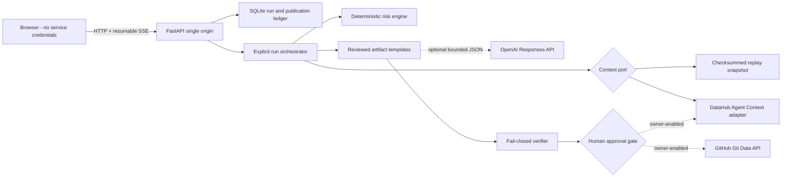

# ChangeSafe

ChangeSafe is a metadata-aware, pre-merge safety agent for analytics schema changes. It turns a proposed column rename, removal, or type change into an evidence-backed risk decision and a verified seven-file migration package before anything can be published.

The default replay experience is credential-free and deterministic. The live adapters can read DataHub context, use a bounded OpenAI planning call, create a GitHub pull request, and write an approval record back to DataHub when an owner explicitly enables those operations.


## What the golden workflow proves

The seeded `dim_customers.customer_email` rename produces the same auditable result on every clean replay run:

- Exactly four downstream assets across Analytics, Marketing, Support, and Executive Reporting.
- A deterministic score of 90/100 (Critical), with every point tied to metadata evidence.
- A conservative two-phase migration that keeps `customer_email` while introducing `primary_email`.
- Seven generated artifacts with exact SHA-256 hashes.
- Twelve blocking validation checks covering metadata alignment, unique outputs, paths, SQL, dbt YAML, compatibility, rollback, and the manifest.
- An approval receipt and downloadable unified patch labeled `NOT WRITTEN - SNAPSHOT MODE`.

Replay approval never contacts or mutates GitHub, DataHub, a warehouse, or OpenAI.

## Fastest start: Docker replay

Prerequisite: Docker Desktop with Compose.

```powershell
docker compose up --build
```

Open [http://localhost:8000](http://localhost:8000), click **Analyze change**, inspect the result, and click **Approve preview**. No API keys are required.

Stop the service with `Ctrl+C`; the SQLite run ledger remains in the named `changesafe-data` volume. To remove only that project-owned volume later, run `docker compose down --volumes`.

## Local development

Prerequisites:

- Python 3.12
- Node.js 24
- pnpm 11.16.0

```powershell
py -3.12 -m venv .venv
.\.venv\Scripts\python.exe -m pip install -e ".[dev,live]"
corepack enable
corepack prepare pnpm@11.16.0 --activate
pnpm install --frozen-lockfile
.\scripts\dev.ps1
```

The development UI runs at [http://localhost:5173](http://localhost:5173) and proxies API/SSE requests to [http://localhost:8000](http://localhost:8000). Custom ports are supported:

```powershell
.\scripts\dev.ps1 -ApiPort 8123 -WebPort 5174
```

## Private configuration on this laptop

The prepared private file is outside the repository:

```text
C:\Users\harik\ChangeSafe\private\changesafe.env
```

Leave values blank for replay. Add only the integrations you want to validate. The application normalizes blank optional values as unconfigured and never exposes secret values through `/api/public-config`.

The application and DataHub seed command automatically look for this exact private path. If you move the file, set `CHANGESAFE_ENV_FILE` to its new absolute path.

Run local development with that file:

```powershell
.\scripts\dev.ps1 -EnvFile "C:\Users\harik\ChangeSafe\private\changesafe.env"
```

Run the container with it:

```powershell
docker compose --env-file "C:\Users\harik\ChangeSafe\private\changesafe.env" up --build
```

Never copy the private file into this repository. `.env*`, databases, test artifacts, and private work directories are ignored.

## Configuration and access needed for live proof

| Variable | Purpose | Minimum access |
| --- | --- | --- |
| `CHANGESAFE_MODE` | `replay`, `live`, or startup selection with `auto` | None |
| `DATAHUB_GMS_URL` | DataHub GMS endpoint | Network reachability from the server |
| `DATAHUB_GMS_TOKEN` | Metadata reads | Entities, schema fields, lineage, and dataset-query context |
| `DATAHUB_TIMEOUT_SECONDS` | Per-attempt live DataHub timeout, default `8` | None |
| `DATAHUB_RETRY_COUNT` | Retry count for transport/timeouts, default `1` | None |
| `SAVE_DOCUMENT_RESTRICT_UPDATES` | Agent Context document guard; set `false` only for ChangeSafe's allowlisted deterministic decision upserts | Required for live writeback |
| `OPENAI_API_KEY` | Optional bounded prose/transformation planning | Responses API access to `OPENAI_MODEL` |
| `OPENAI_INPUT_COST_PER_MILLION_USD` | Conservative input-token accounting rate, default `10` | Update when configured model pricing changes |
| `OPENAI_OUTPUT_COST_PER_MILLION_USD` | Conservative output-token accounting rate, default `60` | Update when configured model pricing changes |
| `OPENAI_MAX_INPUT_TOKENS_PER_CALL` | Hard byte-conservative input ceiling, default `16000` | None |
| `OPENAI_MAX_OUTPUT_TOKENS_PER_CALL` | Responses output ceiling, default `1800` | None |
| `CHANGESAFE_LLM_BUDGET_USD` | Atomic project LLM ceiling, default `5` | None |
| `CHANGESAFE_RUNS_PER_MINUTE` | Per-client, per-process run limit, default `10` | None |
| `GITHUB_TOKEN` | Optional owner-gated publication | Contents and pull-request read/write on one repository |
| `CHANGESAFE_GITHUB_REPOSITORY` | Publication target, such as `owner/repo` | Repository must already exist |
| `CHANGESAFE_ADMIN_TOKEN` | Server-side approval gate for all external mutations | Use a random, private value |
| `PUBLIC_PR_ENABLED` | Enables GitHub branch/commit/PR creation | Keep `false` until live testing |
| `PUBLIC_WRITEBACK_ENABLED` | Enables DataHub decision writeback | Keep `false` until live testing |
| `DEMO_URN_ALLOWLIST` | Semicolon-separated DataHub targets | Include only seeded demo URNs |

DataHub writeback additionally needs permission for the allowlisted equivalents of `save_document`, `add_structured_properties`, and `add_tags`, plus `SAVE_DOCUMENT_RESTRICT_UPDATES=false` so Agent Context Kit can create ChangeSafe's deterministic, idempotent document URN. ChangeSafe still enforces its owner token and exact target allowlist, and startup fails closed if writeback is enabled without that explicit setting. External mutation flags fail configuration unless `CHANGESAFE_ADMIN_TOKEN` is present. The browser never receives DataHub, OpenAI, or GitHub credentials; in live publication mode the owner enters the separate admin approval token. LLM runs reserve their two-call worst-case estimate atomically before work starts, then persist actual response usage; calls without usage telemetry retain the conservative reservation.

See [.env.example](.env.example) for every supported setting.

### Seed and verify a live DataHub instance

First preview the deterministic graph without making a network call:

```powershell
.\.venv\Scripts\python.exe scripts\seed_datahub.py
```

After adding `DATAHUB_GMS_URL` and `DATAHUB_GMS_TOKEN` to the private file, apply idempotent UPSERT proposals and immediately verify them through the same live adapter used by the application:

```powershell
.\.venv\Scripts\python.exe scripts\seed_datahub.py --apply
```

For a read-only contract check against an already seeded instance:

```powershell
.\.venv\Scripts\python.exe scripts\seed_datahub.py --verify-only
```

The seed token needs metadata proposal/write access. Application writeback remains separately disabled until `PUBLIC_WRITEBACK_ENABLED=true`, an allowlist is present, and an admin approval token is supplied.

## Safety model

The LLM cannot set or change the score. The versioned rules are:

| Factor | Points |
| --- | ---: |
| Rename / removal / incompatible type change / widening type change | 25 / 40 / 35 / 15 |
| Downstream assets | 5 each, capped at 25 |
| Dashboard or executive report downstream | 15 |
| Production ML downstream | 15 |
| Governed, confidential, or PII field | 10 |
| High query usage | 10 |
| Cross-domain impact | 10 |
| Missing accountable owner | 10 |

The score is capped at 100; 0-29 is Low, 30-59 Medium, 60-79 High, and 80-100 Critical.

Publication is blocked unless the verifier confirms the seven-file allowlist, parses all SQL, validates dbt YAML, finds both old and new fields for phase one, rejects unqualified `SELECT *`, checks referenced relations, validates compatibility and rollback instructions, and recomputes the exact manifest hashes.

## Architecture



The React build is served by FastAPI, so the UI, API, downloadable patch, and SSE stream share one origin. Runs and publication steps are persisted in SQLite. Publication uses an artifact-bound SHA-256 idempotency key; a partial retry resumes only the missing side effect.

Read [docs/architecture.md](docs/architecture.md) for component boundaries, state transitions, trust boundaries, and deployment details.

## API surface

- `GET /healthz`
- `GET /api/public-config`
- `POST /api/runs`
- `GET /api/runs/{run_id}`
- `GET /api/runs/{run_id}/events`
- `GET /api/runs/{run_id}/artifacts/{path}`
- `POST /api/runs/{run_id}/continue-with-snapshot`
- `POST /api/runs/{run_id}/approve`
- `GET /api/runs/{run_id}/publication.patch`

The SSE endpoint supports both `Last-Event-ID` and `?after=<sequence>` for resumable progress.

## Verification commands

```powershell
.\.venv\Scripts\python.exe -m ruff check .
.\.venv\Scripts\python.exe -m mypy apps/api/src
.\.venv\Scripts\python.exe -m pytest -q
pnpm --filter @changesafe/web lint
pnpm --filter @changesafe/web typecheck
pnpm --filter @changesafe/web test --run
pnpm --filter @changesafe/web build
pnpm exec playwright test
python scripts/check_secrets.py
docker build -t changesafe:local .
```

The checked-in sample migration is also parsed and materialized with pinned dbt packages in an isolated environment:

```powershell
py -3.12 -m venv .venv-dbt
.\.venv-dbt\Scripts\python.exe -m pip install -e ".[dbt]"
.\.venv-dbt\Scripts\dbt.exe parse --project-dir fixtures/dbt_project --profiles-dir fixtures/dbt_project
.\.venv-dbt\Scripts\dbt.exe build --project-dir fixtures/dbt_project --profiles-dir fixtures/dbt_project
```

CI repeats those gates, runs the browser golden flow, checks the license and tracked files for credential signatures, builds the release image, and smoke-tests its health and UI. Optional live authentication checks execute only when their corresponding repository secrets exist and never perform writes.

## Repository map

```text
apps/api/                     FastAPI, domain, adapters, verifier, publication
apps/web/                     React workspace and component tests
fixtures/datahub/             Canonical replay snapshot and checksum
examples/                     Unsafe input and verified seven-file output
scripts/                      Development, seed, capture, and secret checks
tests/e2e/                    Credential-free browser acceptance
docs/                         Architecture, demo, submission, and design evidence
```

## Honest limitations

- No warehouse SQL is executed, no PR is merged automatically, and replay mode never mutates external systems.
- SQLite plus in-process analysis tasks target a single service instance. Multi-replica production deployment needs a shared database and durable job queue.
- Public internet deployment should add distributed reverse-proxy rate limiting and managed TLS. The app itself enforces a per-client, per-process run limit, strict schemas, a 16 KiB request boundary, same-origin CSP, allowlisted generated paths, and owner-gated mutations.
- `auto` attempts live context when both DataHub settings exist; otherwise it selects replay. A failed live read pauses in `context_fallback_required` and changes evidence source only after the user clicks **Continue with labeled snapshot**. Authorization failures are not retried, and no fallback is permitted after publication begins.
- An actual live DataHub receipt, real GitHub pull request, and hosted URL require the external credentials and targets listed above; they cannot be truthfully produced from replay credentials.

## Demo and submission material

- [Under-three-minute demo script](docs/demo-script.md)
- [Devpost-ready submission copy](docs/devpost-submission.md)
- [AI-assistance disclosure](docs/ai-assistance.md)
- [Design system and visual fidelity notes](docs/design/changesafe-design-system.md)

The mobile completion state is also captured here:


## License

Apache License 2.0. See [LICENSE](LICENSE).
