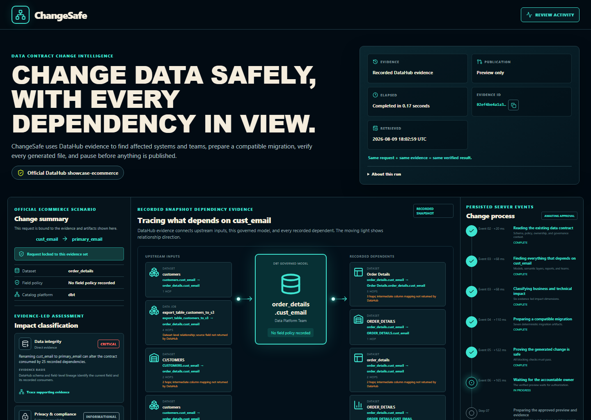
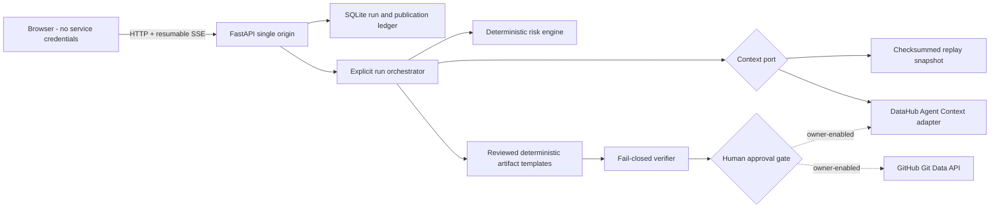
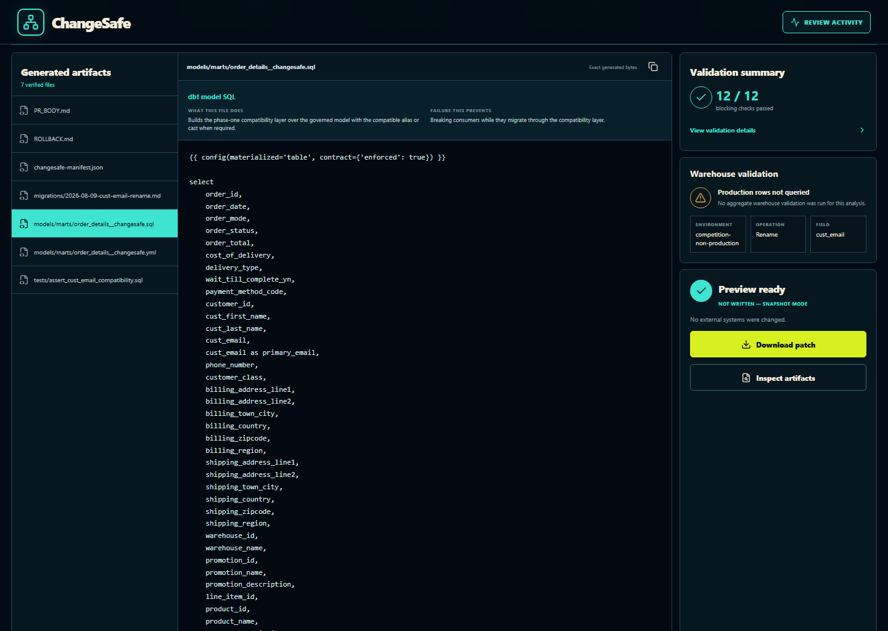
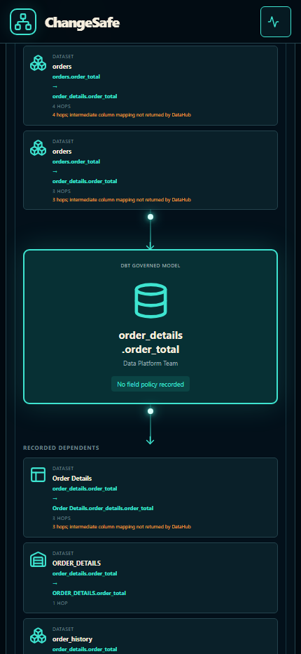
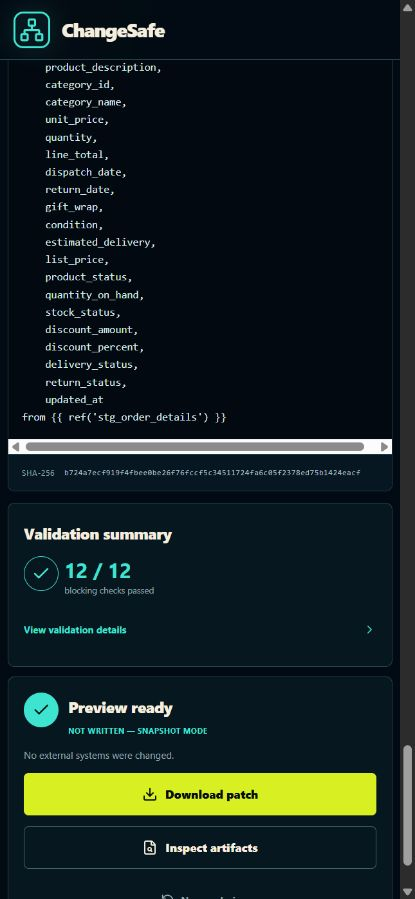

# ChangeSafe

ChangeSafe is a metadata-aware, pre-merge safety agent for analytics schema changes. It lets an analyst select a supported field, then turns a proposed rename, removal, or type change into an evidence-backed impact decision and a verified seven-file migration package before anything can be published.

The default recorded-evidence experience is credential-free and deterministic. It replays a checksummed DataHub evidence bundle through the real ChangeSafe pipeline; it is not a simulated UI. The live adapters can read DataHub context, create a GitHub pull request, and write an approval record back to DataHub when an owner explicitly enables those operations.



The overview above shows the evidence map and persisted process. The lower-state
proof below shows the exact generated bytes, 12/12 blocking checks, and the
non-mutating approval receipt.

## What the golden workflow proves

The golden workflow uses DataHub's official `showcase-ecommerce` datapack. Recorded replay exposes the complete 55-field, allowlisted `Order Entry Analytics.order_details` schema. Its default demonstration evaluates a rename of `cust_email` to `primary_email` and produces the same auditable result on every clean replay run:

- The field picker displays the native type and nullability returned for every supported field. It is evidence-backed; it is not an email-only preset or a free-text escape hatch.
- For the default `cust_email` rename, six upstream and 25 downstream recorded relationships are evaluated across Snowflake, Power BI, and Looker. Direct field routes, endpoint-only multi-hop routes, and dataset-only relationships are labeled separately.
- Six plain-language impact classifications covering data integrity, privacy compliance, operational continuity, decision trust, financial exposure, and organizational impact.
- A deterministic score of 85/100 (Critical), with every point tied to metadata evidence.
- A directional dependency map with moving lineage signals, route limitations, evidence tracing, and an accessible list for nonvisual review.
- A conservative two-phase migration that keeps `cust_email` while introducing `primary_email` through a generated dbt compatibility shim. The governed base model remains unchanged during phase one.
- Seven generated artifacts with exact SHA-256 hashes and a plain-language explanation of what each file does and which failure it prevents.
- Twelve blocking validation checks covering metadata alignment, unique outputs, paths, SQL, dbt YAML, compatibility, rollback, and the manifest.
- An approval receipt and downloadable unified patch labeled `NOT WRITTEN - SNAPSHOT MODE`.

The visible process is reconstructed from persisted backend events and reports measured elapsed time. It can finish in a fraction of a second on a local recorded bundle because there is no network wait. Repeating the same request against the same evidence intentionally produces the same verified result; changing the selected field, operation, target name, or type changes the request-bound assessment and artifacts. Replay approval never contacts or mutates external systems.

## What multi-field replay proves

Recorded replay carries field-scoped context for every supported field. It does not copy governance, usage, or lineage claims from `cust_email` onto another field. The representative rename results below are deterministic for the captured evidence; equal scores are possible when the metadata supports the same risk factors.

| Selected field | Captured relationship context | Recorded rename result |
| --- | --- | --- |
| `cust_email` | 6 upstream, 25 downstream | 85/100, Critical |
| `order_total` | 6 upstream, 31 downstream | 75/100, High |
| `order_status` | 6 upstream, 27 downstream | 75/100, High |

Every dependency route has one of three evidence precisions. **Exact field route** means both endpoint columns were returned. **Endpoint-only field route** means DataHub returned a known endpoint and a multi-hop asset path, but not an intermediate column mapping. **Dataset-level relationship** means the relationship was returned without the relevant endpoint field. ChangeSafe states those limitations rather than inferring column mappings from matching names.

## Hosted competition pilot

ChangeSafe can be deployed as a credential-free, competition-ready pilot on
Render. The hosted default executes the real analysis, generation, verification,
event, preview-approval, and patch paths against checksum-pinned
Recorded DataHub evidence. It does not query production rows or enable external
mutations.

[Open the permanent ChangeSafe competition demo](https://changesafe-competition.onrender.com).
The first request may take about a minute when Render wakes the free service.

[](https://render.com/deploy?repo=https://github.com/marker2601/changesafe)

The free service can sleep after inactivity and may take extra time on its first
request. Its ephemeral filesystem may clear earlier run history after a restart;
start a new analysis if that happens. Upgrade the same service with a persistent
disk mounted at `/data` before claiming durable hosted history.

Live hosted metadata requires a publicly reachable DataHub GMS URL and a
server-side token. Keep replay mode enabled until that endpoint exists and the
live smoke test passes from the hosted environment.

## Fastest start: Docker replay

Prerequisite: Docker Desktop with Compose.

```powershell
docker compose up --build
```

Open [http://localhost:8000](http://localhost:8000), select a supported field from **Current field**, click **Analyze change**, inspect the evidence-bound result, and click **Approve preview**. No API keys are required.

Stop the service with `Ctrl+C`; the SQLite run ledger remains in the named `changesafe-data` volume. To remove only that project-owned volume later, run `docker compose down --volumes`.

## Local development

Prerequisites:

- Python 3.12
- Node.js 24
- pnpm 11.16.0

```powershell
py -3.12 -m venv .venv
.\.venv\Scripts\python.exe -m pip install -e ".[dev,live,warehouse]"
corepack enable
corepack prepare pnpm@11.16.0 --activate
pnpm install --frozen-lockfile
.\scripts\dev.ps1
```

The development UI runs at [http://localhost:5173](http://localhost:5173) and proxies API/SSE requests to [http://localhost:8000](http://localhost:8000). Custom ports are supported:

```powershell
.\scripts\dev.ps1 -ApiPort 8123 -WebPort 5174
```

## Private configuration on this laptop

The prepared private file is outside the repository:

```text
C:\Users\harik\ChangeSafe\private\changesafe.env
```

Leave values blank for replay. Add only the integrations you want to validate. The application normalizes blank optional values as unconfigured and never exposes secret values through `/api/public-config`.

The application and DataHub seed command automatically look for this exact private path. If you move the file, set `CHANGESAFE_ENV_FILE` to its new absolute path.

Run local development with that file:

```powershell
.\scripts\dev.ps1 -EnvFile "C:\Users\harik\ChangeSafe\private\changesafe.env"
```

Run the container with it:

```powershell
docker compose --env-file "C:\Users\harik\ChangeSafe\private\changesafe.env" up --build
```

The default service never mounts a warehouse key. After supplying the complete
read-only warehouse configuration, start the warehouse profile explicitly; it
bind-mounts the configured PKCS#8 key read-only at
`/run/secrets/snowflake-private-key.p8` and does not copy it into the image:

```powershell
docker compose --env-file "C:\Users\harik\ChangeSafe\private\changesafe.env" --profile warehouse up --build changesafe-warehouse
```

For local and Compose operators, `SNOWFLAKE_PRIVATE_KEY_PATH` is the filesystem
path to the operator-controlled PKCS#8 key mounted read-only by the warehouse
profile. In GitHub Actions only, store the base64-encoded PKCS#8 key content in
the encrypted `SNOWFLAKE_PRIVATE_KEY_PATH` secret. The readiness workflow
decodes it into a mode-600 runner-temporary file, passes that file path to the
runtime under the same variable name, and always deletes the file after the
smoke.

Never copy the private file into this repository. `.env*`, databases, test artifacts, and private work directories are ignored.

## Do I need a DataHub token?

No token is needed to run or review the complete replay workflow. Replay uses the committed, SHA-256-verified catalog of the official ecommerce scenario and exercises the real API, event stream, policy engine, generator, verifier, approval gate, patch creation, and durable run ledger.

A DataHub personal access token is required only when `CHANGESAFE_MODE=live` or `auto` should read a real DataHub instance. The hackathon resource page provides the `showcase-ecommerce` datapack, not a shared DataHub login or token. Create the token in the DataHub instance you control. Live writeback needs additional metadata permissions and remains disabled unless you deliberately enable it.

## Configuration and access needed for live proof

| Variable | Purpose | Minimum access |
| --- | --- | --- |
| `CHANGESAFE_MODE` | `replay`, `live`, or startup selection with `auto` | None |
| `DATAHUB_GMS_URL` | DataHub GMS endpoint | Network reachability from the server |
| `DATAHUB_GMS_TOKEN` | Metadata reads | Entities, schema fields, lineage, and dataset-query context |
| `DATAHUB_UI_URL` | Optional browser-facing catalog origin for evidence links | No secret; for example `http://localhost:9002` |
| `DATAHUB_TIMEOUT_SECONDS` | Per-attempt live DataHub timeout, default `8` | None |
| `DATAHUB_RETRY_COUNT` | Retry count for transport/timeouts, default `1` | None |
| `SAVE_DOCUMENT_RESTRICT_UPDATES` | Agent Context document guard; set `false` only for ChangeSafe's allowlisted deterministic decision upserts | Required for live writeback |
| `CHANGESAFE_RUNS_PER_MINUTE` | Per-client, per-process run limit, default `10` | None |
| `GITHUB_TOKEN` | Optional owner-gated publication | Contents and pull-request read/write on one repository |
| `CHANGESAFE_GITHUB_REPOSITORY` | Publication target, such as `owner/repo` | Repository must already exist |
| `CHANGESAFE_ADMIN_TOKEN` | Server-side approval gate for all external mutations | Use a random, private value |
| `PUBLIC_PR_ENABLED` | Enables GitHub branch/commit/PR creation | Keep `false` until live testing |
| `PUBLIC_WRITEBACK_ENABLED` | Enables DataHub decision writeback | Keep `false` until live testing |
| `DEMO_URN_ALLOWLIST` | Semicolon-separated DataHub targets | Include only seeded demo URNs |
| `CHANGESAFE_LIVE_EVIDENCE_REQUIRED` | Requires live DataHub provenance before approval | Keep `false` for credential-free replay |
| `CHANGESAFE_WAREHOUSE_VALIDATION_ENABLED` | Enables bounded, aggregate-only Snowflake validation | Keep `false` until every warehouse value is supplied |
| `CHANGESAFE_WAREHOUSE_VALIDATION_REQUIRED` | Blocks approval without current passed warehouse evidence | May be `true` only when validation is enabled |

DataHub writeback additionally needs permission for the allowlisted equivalents of `save_document`, `add_structured_properties`, and `add_tags`, plus `SAVE_DOCUMENT_RESTRICT_UPDATES=false` so Agent Context Kit can create ChangeSafe's deterministic, idempotent document URN. ChangeSafe still enforces its owner token and exact target allowlist, and startup fails closed if writeback is enabled without that explicit setting. External mutation flags fail configuration unless `CHANGESAFE_ADMIN_TOKEN` is present. The browser never receives DataHub or GitHub credentials; in live publication mode the owner enters the separate admin approval token.

See [.env.example](.env.example) for every supported setting.

### Where to get each value

| Value | Where it comes from |
| --- | --- |
| `DATAHUB_GMS_URL` | Self-hosted quickstart: `http://localhost:8080`. DataHub Cloud: use the metadata-service URL supplied for your tenant. It must be reachable from the ChangeSafe server. |
| `DATAHUB_UI_URL` | The URL you open in a browser: quickstart `http://localhost:9002`, or your DataHub Cloud tenant origin such as `https://tenant.acryl.io`. Do not include credentials or a dataset path. |
| `DATAHUB_GMS_TOKEN` | In DataHub, open **Settings → Access Tokens → Generate new token**. Your DataHub policy must allow token creation and the metadata reads ChangeSafe performs. Store the token only in `changesafe.env`. |
| `GITHUB_TOKEN` | Optional. Create a fine-grained GitHub token restricted to the one sandbox repository, with Contents and Pull requests read/write. |
| `CHANGESAFE_GITHUB_REPOSITORY` | The existing target repository in `owner/name` form, for example `marker2601/changesafe-sandbox`. |
| `CHANGESAFE_ADMIN_TOKEN` | Generate this yourself as a long random secret. It is separate from every service token and gates private review activity plus external publication. |
| DataHub URL/token | Use a self-hosted GMS endpoint or DataHub Cloud metadata-service URL and an admin/service-account token with metadata read access. These values read live metadata only while publication flags remain off. |
| Snowflake account/user | Use the Snowflake account identifier and a dedicated service user. |
| Authenticator/private key | Use `SNOWFLAKE_JWT` and an operator-mounted PKCS#8 private key whose public key is assigned to the dedicated service user. |
| Warehouse/database/schema/role | Use dedicated non-production compute and the exact read-only role with `USAGE` plus `SELECT` only on the mapped relation. |
| Relation map | Configure `SNOWFLAKE_TARGET_RELATION_ALLOWLIST` server-side as JSON from the exact DataHub URN to the exact three-part Snowflake relation. |
| GitHub/admin token | Needed only when the owner deliberately enables publication. Neither token is needed for preview judging. |

The browser never receives any service token. Reviewers use the shared UI without credentials; only the operator enters `CHANGESAFE_ADMIN_TOKEN` into the private review-activity drawer or an owner-gated publication action.

The DataHub token is required for live judging but not for credential-free
replay. Snowflake is required only when
`CHANGESAFE_WAREHOUSE_VALIDATION_REQUIRED=true`; otherwise the competition
smoke reports warehouse validation as not run. The smoke always forces GitHub
and DataHub publication off and approves preview only:

```powershell
.\.venv\Scripts\python.exe scripts\smoke_competition.py --datahub-only
```

### Seed and verify a live DataHub instance

Install and start DataHub, then load the organizer-provided graph:

```powershell
datahub docker quickstart
datahub init
.\.venv\Scripts\python.exe scripts\load_showcase_datapack.py
.\.venv\Scripts\python.exe scripts\load_showcase_datapack.py --apply
```

The first command is a no-I/O preview. `--apply` resolves DataHub's official
`showcase-ecommerce` pack and loads its ordered files through synchronous RESTLI
writes; a completed load record is saved only after every part succeeds.

ChangeSafe's seed script does not replace that graph. First preview its small, namespaced overlay without making a network call:

```powershell
.\.venv\Scripts\python.exe scripts\seed_datahub.py
```

After adding `DATAHUB_GMS_URL` and `DATAHUB_GMS_TOKEN` to the private file, apply idempotent overlay proposals and immediately verify them through the same live adapter used by the application:

```powershell
.\.venv\Scripts\python.exe scripts\seed_datahub.py --apply
```

For a read-only contract check against an already seeded instance:

```powershell
.\.venv\Scripts\python.exe scripts\seed_datahub.py --verify-only
```

The seed token needs metadata proposal/write access. Application writeback remains separately disabled until `PUBLIC_WRITEBACK_ENABLED=true`, an allowlist is present, and an admin approval token is supplied.

## Safety model

The deterministic policy engine sets the score. The versioned rules are:

| Factor | Points |
| --- | ---: |
| Rename / removal / incompatible type change / widening type change | 25 / 40 / 35 / 15 |
| Downstream assets | 5 each, capped at 25 |
| Dashboard or executive report downstream | 15 |
| Production ML downstream | 15 |
| Governed, confidential, or PII field | 10 |
| High query usage | 10 |
| Cross-domain impact | 10 |
| Missing accountable owner | 10 |

The score is capped at 100; 0-29 is Low, 30-59 Medium, 60-79 High, and 80-100 Critical.

Publication is blocked unless the verifier confirms the seven-file allowlist, parses all SQL, validates dbt YAML, finds both old and new fields for phase one, rejects unqualified `SELECT *`, checks referenced relations, validates compatibility and rollback instructions, and recomputes the exact manifest hashes.

## Architecture



The React build is served by FastAPI, so the UI, API, downloadable patch, and SSE stream share one origin. Runs and publication steps are persisted in SQLite. Publication uses an artifact-bound SHA-256 idempotency key; a partial retry resumes only the missing side effect.

Read [docs/architecture.md](docs/architecture.md) for component boundaries, state transitions, trust boundaries, and deployment details.

## API surface

- `GET /healthz`
- `GET /api/public-config`
- `GET /api/schema-fields` (allowlisted schema discovery; no credentials returned)
- `GET /api/owner/activity` (owner token required; privacy-limited rows only)
- `POST /api/runs`
- `GET /api/runs/{run_id}`
- `GET /api/runs/{run_id}/events`
- `GET /api/runs/{run_id}/artifacts/{path}`
- `POST /api/runs/{run_id}/continue-with-snapshot`
- `POST /api/runs/{run_id}/approve`
- `GET /api/runs/{run_id}/publication.patch`

The SSE endpoint supports both `Last-Event-ID` and `?after=<sequence>` for resumable progress.

## Verification commands

```powershell
.\.venv\Scripts\python.exe -m ruff check --no-cache .
.\.venv\Scripts\python.exe -m mypy apps/api/src scripts
.\.venv\Scripts\python.exe -m pytest -q
pnpm --filter @changesafe/web lint
pnpm --filter @changesafe/web typecheck
pnpm --filter @changesafe/web test --run
pnpm --filter @changesafe/web build
pnpm exec playwright test
.\.venv\Scripts\python.exe scripts/regenerate_examples.py --check
.\.venv\Scripts\python.exe scripts/check_secrets.py
docker build -t changesafe:local .
```

The checked-in sample migration is also parsed and materialized with pinned dbt packages in an isolated environment:

```powershell
py -3.12 -m venv .venv-dbt
.\.venv-dbt\Scripts\python.exe -m pip install -e ".[dbt]"
.\.venv-dbt\Scripts\dbt.exe parse --project-dir fixtures/dbt_project --profiles-dir fixtures/dbt_project
.\.venv-dbt\Scripts\dbt.exe build --project-dir fixtures/dbt_project --profiles-dir fixtures/dbt_project
```

The fixture keeps the generated DataHub/Snowflake contract bytes unchanged. A
fixture-only DuckDB macro translates those declared types for the local
materialization proof; `scripts/regenerate_examples.py --check` independently
guards byte-for-byte artifact identity.

CI repeats those gates, runs the browser golden flow, checks the license and tracked files for credential signatures, builds the release image, and smoke-tests its health and UI. Optional live authentication checks execute only when their corresponding repository secrets exist and never perform writes.

## Repository map

```text
apps/api/                     FastAPI, domain, adapters, verifier, publication
apps/web/                     React workspace and component tests
fixtures/datahub/             Checksummed replay field catalog and checksum
examples/                     Unsafe input and verified seven-file output
scripts/                      Development, seed, capture, and secret checks
tests/e2e/                    Credential-free browser acceptance
docs/                         Architecture, demo, submission, and design evidence
```

## Honest limitations

- Warehouse validation is disabled by default. When explicitly enabled, it executes only the reviewed aggregate `SELECT` contract through a dedicated read-only role; it never executes warehouse mutations. No PR is merged automatically, and replay mode never mutates external systems.
- SQLite plus in-process analysis tasks target a single service instance. Multi-replica production deployment needs a shared database and durable job queue.
- Public internet deployment should add distributed reverse-proxy rate limiting and managed TLS. The app itself enforces a per-client, per-process run limit, strict schemas, a 16 KiB request boundary, same-origin CSP, allowlisted generated paths, and owner-gated mutations.
- `auto` attempts live context when both DataHub settings exist; otherwise it selects replay. A failed live read pauses in `context_fallback_required` and changes evidence source only after the user clicks **Continue with labeled snapshot**. Authorization failures are not retried, and no fallback is permitted after publication begins.
- The official credential-free/default replay proof reads catalog context and generates migration code without querying customer records or executing warehouse SQL. When live warehouse validation is explicitly enabled, ChangeSafe executes only the reviewed, allowlisted aggregate `SELECT` plans and never returns raw row data.
- A field name that looks similar at two assets is not column-mapping evidence. When DataHub omits an endpoint field or intermediate mapping, ChangeSafe shows that absence as a route limitation instead of inventing a path.
- An actual live DataHub receipt and real GitHub pull request require the external credentials and targets listed above; they cannot be truthfully produced from replay credentials.

## Demo and submission material

- [Under-three-minute demo script](docs/demo-script.md)
- [Devpost-ready submission copy](docs/devpost-submission.md)
- [AI-assistance disclosure](docs/ai-assistance.md)
- [Design system and visual fidelity notes](docs/design/changesafe-design-system.md)
- [Verified visual QA report](design-qa.md)
- [Privacy-safe shared sandbox runbook](docs/shared-sandbox-runbook.md)
- [Editable Figma implementation capture](https://www.figma.com/design/6PeVH3STqBzH9hK6TrOalu?node-id=2-2)

Desktop artifact and receipt proof:



The same recorded-evidence experience is captured at the phone breakpoint in
two deliberate, non-stitched viewport frames:





## License

Apache License 2.0. See [LICENSE](LICENSE).
