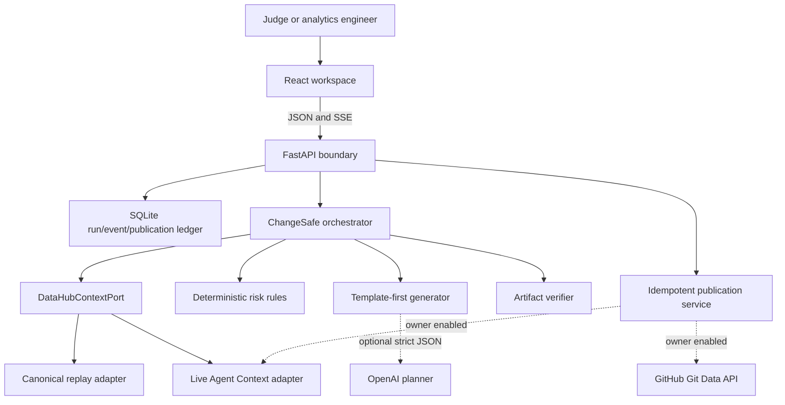
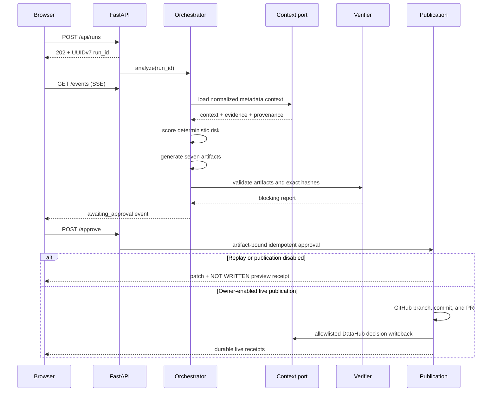
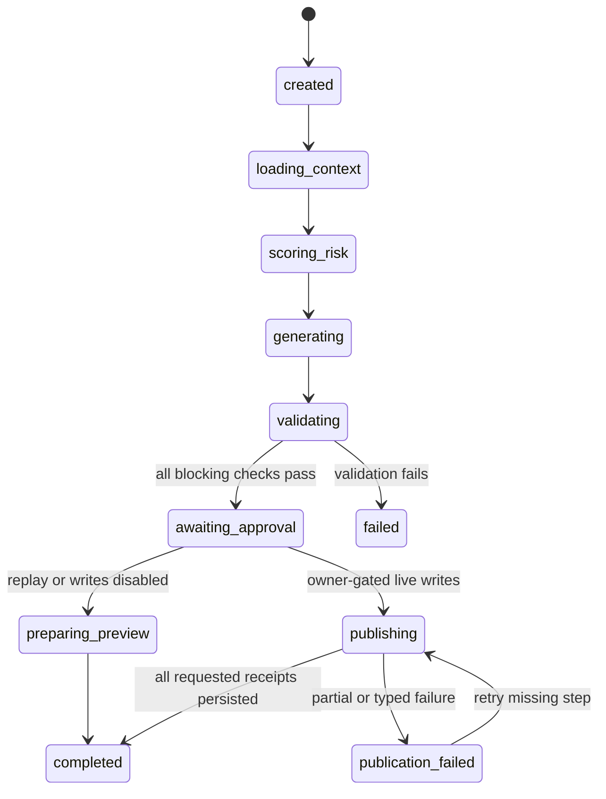

# ChangeSafe architecture

## System boundary

ChangeSafe has one browser origin and one server process. The browser owns presentation and short-lived UI state. FastAPI owns credentials, validation, run state, artifact bytes, approval, and all external integration calls.

## Run sequence

## State machine

Every transition is validated and written to `run_events` before it is streamed. Clients resume with the last sequence number. Terminal streams close only after all stored events are delivered.

## Context adapters

Both adapters return the same strict `ContextBundle` contract.

- Replay verifies `fixtures/datahub/golden-context.json` against its committed SHA-256 before parsing it. The resulting provenance is `snapshot` and contains the hash.
- Live uses the `datahub-agent-context` tool surface for entities, schema fields, bounded lineage, and query context. Tool evidence records sanitized parameters, duration, result count, and referenced URNs.
- Live reads and writes reject targets outside `DEMO_URN_ALLOWLIST` before a tool call is made.

No replay code path initializes a network client.

## Generation and verification

Reviewed templates define the seven paths and safety invariants. When an OpenAI key exists, one strict structured-output call may supply bounded narrative and transformation fields; one repair call is allowed only after schema validation failure. On timeout or planning failure, the deterministic template remains available. The planner cannot change the risk score, remove a required file, or bypass validation.

The verifier operates on in-memory bytes and blocks publication on any failed mandatory check. Generated code is parsed but never executed.

## Publication and idempotency

The publication key hashes the normalized request, source commit, and final artifact manifest. The local ledger stores intermediate GitHub and DataHub receipts. A retry with the same artifact hash returns or resumes the existing ledger entry; a conflicting artifact hash fails closed.

Replay approval creates a unified patch and preview receipt only. Live mutation also requires:

1. A matching admin token supplied to the approval request.
2. The relevant server-side feature flag.
3. Integration credentials and target configuration.
4. An allowlisted DataHub URN.
5. A fully passing validation report.

## Trust and security boundaries

- Service credentials stay in environment-backed `SecretStr` settings.
- `/api/public-config` returns capabilities, never credential values.
- HTTP responses receive CSP, clickjacking, MIME-sniffing, referrer, opener, and permissions headers.
- Request bodies larger than 16 KiB are rejected before JSON parsing.
- Pydantic models reject unknown keys and invalid operations.
- Artifact paths are POSIX-normalized and checked against a seven-path allowlist.
- UI code and Markdown are rendered as text; generated HTML is not injected.
- The container runs as UID 10001 with a read-only filesystem and a dedicated `/data` volume.

For a public deployment, terminate TLS and add per-IP rate limiting at the edge. For multiple replicas, replace in-process background work and SQLite with a durable queue and shared transactional store.

## Deployment

The multi-stage image builds React under Node 24, installs Python 3.12 plus the live DataHub adapter, copies only the compiled frontend into the runtime, and exposes port 8000. FastAPI serves static assets after API routes so `/api/*` cannot be shadowed.
