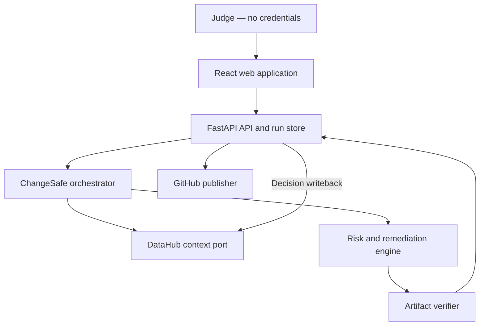

# ChangeSafe Design Specification

**Date:** 2026-08-06  
**Status:** Approved for implementation planning  
**Challenge focus:** Agents That Do Real Work + Metadata-Aware Code Generation & Development

## 1. Executive summary

ChangeSafe is a pre-merge safety agent for analytics engineering changes. A developer submits a proposed column rename, removal, or type change. ChangeSafe reads the organization’s actual metadata context from DataHub—schema, column and table lineage, downstream consumers, owners, governance signals, and query usage—before it decides whether the change is safe.

For unsafe changes, ChangeSafe generates a conservative two-phase migration package containing production-oriented dbt/SQL changes, schema tests, a data contract update, a deprecation plan, rollback instructions, and a pull-request description. It validates the generated artifacts before allowing publication. After human approval, it can publish a GitHub pull request and write a durable decision record, risk metadata, and deprecation context back to DataHub so later humans and agents inherit the result.

The hosted demonstration requires no credentials from judges. It supports a live mode backed by server-side DataHub and LLM credentials and an honest replay mode backed by a versioned snapshot captured from a live DataHub run. The repository also includes a reproducible DataHub seed scenario.

## 2. Product goal

The goal is to prevent avoidable data outages caused by apparently small schema changes whose downstream impact is invisible inside a code review.

The project succeeds when a judge can:

1. Open a public URL without signing in.
2. Run a seeded breaking-change scenario.
3. See evidence retrieved from DataHub and the resulting blast radius.
4. Understand why the deterministic risk decision was made.
5. Inspect valid generated migration artifacts.
6. See verification evidence, a pull-request artifact, and a DataHub writeback receipt.
7. Reproduce the same workflow from a clean clone.

## 3. Target users

- Analytics engineers proposing dbt or SQL model changes.
- Data platform engineers responsible for reliability and governance.
- Data owners reviewing downstream business impact.
- AI coding agents that need organizational context before editing data code.

## 4. Scope

### 4.1 Supported changes

Version 1 supports one column operation per run:

- Rename a column.
- Remove a column.
- Change a column’s type.

The primary demonstration is a rename of `dim_customers.customer_email` to `primary_email` without a compatibility alias.

### 4.2 Generated remediation

For a breaking rename, the safe phase-one remediation keeps the old column available while introducing the new name, updates declared schema and contracts, adds compatibility tests, records a deprecation window, and supplies rollback instructions. It does not silently apply or merge the migration.

### 4.3 Non-goals

- Executing SQL against a production warehouse.
- Automatically merging a pull request.
- Supporting arbitrary multi-file application changes.
- Replacing DataHub’s catalog, lineage UI, or metadata management features.
- Predicting runtime data values that are not represented in metadata.
- Allowing public users to mutate arbitrary DataHub assets or GitHub repositories.

## 5. Three-minute demonstration narrative

1. The judge opens ChangeSafe and sees `LIVE` or `DATAHUB SNAPSHOT` status.
2. The judge chooses the preloaded `customer_email` rename and clicks **Analyze change**.
3. A timeline shows DataHub context retrieval: asset resolution, schema, lineage, ownership/governance, and usage evidence.
4. The impact view reveals four downstream assets across Analytics, Marketing, and Executive Reporting, including a customer-retention dashboard. It also shows that the field is governed as PII and is highly used.
5. ChangeSafe assigns a deterministic critical risk score and explains every contributing factor.
6. The generated-files view shows the safe compatibility change, dbt schema update, test, migration notes, rollback, and PR body.
7. The verifier parses SQL, cross-checks selected columns against YAML, and confirms the old and new names coexist during phase one.
8. The judge approves publication. The app displays a sample or live GitHub PR and a DataHub writeback receipt containing the decision document and asset metadata updates.

The core story finishes within 150 seconds, leaving time to show the public repository and test status.

## 6. Operating modes

### 6.1 Live mode

The backend uses server-side credentials to call the official DataHub Agent Context Kit tool surface. Judges never provide or receive credentials. The LLM key is also server-side. Live mode publishes DataHub mutations only after approval, only when `PUBLIC_WRITEBACK_ENABLED=true`, and only to an allowlisted demonstration namespace.

### 6.2 Replay mode

Replay mode uses a committed, versioned context snapshot captured from a successful live DataHub run. It runs the same normalization, risk, generation, and verification pipeline after context acquisition. The UI labels the run `DATAHUB SNAPSHOT`, displays the snapshot timestamp and hash, and never represents replayed calls as new network calls.

Replay mode is the default when credentials are absent. It guarantees that a clean clone and public deployment remain testable if a trial expires or an external service is unavailable.

### 6.3 Auto mode

Auto mode attempts a live context read twice with an eight-second timeout per attempt. If both attempts fail before any external mutation begins, the user may continue with the labeled snapshot. ChangeSafe never switches modes silently and never falls back after publication starts.

## 7. Architecture



The application is a monorepo with a React/TypeScript frontend and Python/FastAPI backend. A multi-stage Docker build compiles the frontend and serves it from the backend, producing one deployable container and one public origin.

### 7.1 Component boundaries

| Component | Responsibility | Depends on |
| --- | --- | --- |
| Web application | Collect change input, stream progress, visualize impact, display diffs and receipts | HTTP/SSE API only |
| API layer | Validate requests, isolate sessions, expose runs, enforce publication gates | Orchestrator and run store |
| Orchestrator | Execute the explicit run state machine and collect evidence | Ports for context, LLM, generation, verification, and publication |
| DataHub context port | Resolve assets; retrieve schemas, lineage, owners, governance, and usage; perform allowlisted writeback | Live Agent Context Kit adapter or replay adapter |
| Risk engine | Produce deterministic score, band, and evidence factors | Normalized change and DataHub context |
| Remediation engine | Select a safe template and ask the LLM for bounded planning/narrative fields | Normalized context and templates |
| Artifact verifier | Parse SQL, validate YAML/contracts, and enforce migration invariants | Generated in-memory file set |
| GitHub publisher | Create branch/commit/PR when enabled; otherwise create patch and PR preview | GitHub API or local artifact writer |
| Run store | Persist run state, evidence, hashes, outputs, and receipts | SQLite locally; compatible persistent volume in deployment |

Each external dependency is behind a typed port so tests can use fakes and replay fixtures without branching throughout business logic.

## 8. Domain contracts

### 8.1 Change request

```json
{
  "asset_urn": "urn:li:dataset:(urn:li:dataPlatform:dbt,analytics.dim_customers,PROD)",
  "operation": "rename",
  "field": "customer_email",
  "new_field": "primary_email",
  "old_type": "STRING",
  "new_type": "STRING",
  "source_commit": "demo-unsafe-change",
  "requested_by": "demo-user"
}
```

`new_field` is required only for rename. `new_type` is required only for type change. Unknown keys are rejected.

### 8.2 Context bundle

The normalized context bundle contains:

- Target asset details and field schema.
- Upstream and downstream table/column lineage paths.
- Downstream entity types and domains.
- Owners and ownership types.
- Tags, glossary terms, and structured properties.
- Query examples and normalized usage tier.
- Stable DataHub URNs for every evidence item.
- Retrieval timestamp, mode, adapter version, and snapshot hash when applicable.

### 8.3 Analysis result

The analysis result contains the deterministic score and band, ordered risk factors with evidence URNs, affected-asset summary, recommended migration strategy, generated file manifest, validation report, and publication eligibility.

### 8.4 Run lifecycle

Every run receives an opaque UUIDv7 `run_id` when it is created. Runs advance through these states:

`created → loading_context → scoring_risk → generating → validating → awaiting_approval → publishing → completed`

In credential-free preview mode, approval follows `awaiting_approval → preparing_preview → completed` and produces no external mutation. Any pre-publication state may transition to `failed`. `publishing` may transition to `publication_failed`; it never reports completed without every requested publication receipt. Retrying publication uses the same `run_id`, idempotency key, and artifact hash.

## 9. DataHub integration

### 9.1 Read operations

The live adapter uses the official `datahub-agent-context` Python package. It invokes the Agent Context Kit tools directly from the explicit ChangeSafe orchestrator; the tools expose the same catalog capabilities and names as DataHub’s MCP server:

- `search` to resolve human-friendly asset input when no URN is supplied.
- `get_entities` for owners, descriptions, tags, terms, domains, and properties.
- `list_schema_fields` to verify the target column and type.
- `get_lineage` for bounded upstream/downstream traversal.
- `get_lineage_paths_between` for exact evidence paths where useful.
- `get_dataset_queries` or `find_sql_context` for query usage evidence.

Every call is recorded as a sanitized evidence envelope containing tool name, bounded parameters, duration, result count, and referenced URNs. Tokens and raw authorization headers are never recorded.

### 9.2 Write operations

After explicit approval and successful artifact validation, the live adapter performs allowlisted writes:

- `save_document` creates or updates the ChangeSafe decision record.
- `add_structured_properties` records risk level, change status, and last run identifier on the target asset.
- `add_tags` applies the `ChangeSafe:Deprecating` tag to the old field during phase one.

The seed process creates the required tag and structured-property definitions. Writeback is restricted to seeded demo URNs in the public deployment.

### 9.3 Idempotency

The publication idempotency key is a SHA-256 digest of the normalized change request, source commit, and final artifact manifest. It is distinct from the opaque `run_id`, which exists before generation begins. Before saving, the adapter searches for the exact idempotency key. Where the SDK accepts a deterministic entity identifier, it derives that identifier from the idempotency key. The local publication ledger also prevents duplicate calls. A retry returns the existing receipt when the artifact hash matches and fails closed when it does not.

### 9.4 Live/replay parity

The replay fixture conforms to the same `DataHubContextPort` response models as the live adapter. Contract tests run the same assertions against both adapters. A capture command sanitizes and writes a canonical JSON snapshot plus SHA-256 checksum.

## 10. Reproducible demo metadata

The repository contains a seed command that emits a compact e-commerce graph into DataHub. It may be loaded alongside the official `showcase-ecommerce` datapack but does not depend on that datapack’s exact asset names.

The seeded graph is:

1. `postgres.sales.customers_raw`
2. `dbt.analytics.stg_customers`
3. `dbt.analytics.dim_customers`
4. `snowflake.analytics.customer_360`
5. `snowflake.marketing.campaign_audiences`
6. `snowflake.support.customer_contact_queue`
7. `looker.executive.customer_retention_dashboard`

Column-level lineage connects `customer_email` through the graph. `dim_customers` has exactly four downstream assets: `customer_360`, `campaign_audiences`, `customer_contact_queue`, and `customer_retention_dashboard`. The target field has:

- PII tag and Customer Email glossary term.
- Data Platform technical owner and Customer Analytics data owner.
- High usage tier with representative query context.
- Downstream consumers in Analytics, Marketing, and Executive Reporting.

All sample data and metadata are synthetic and safe to distribute under Apache 2.0.

## 11. Deterministic risk model

The LLM cannot set or change the risk score. The risk engine uses these versioned rules:

### 11.1 Base severity

- Rename: 25 points.
- Removal: 40 points.
- Narrowing or incompatible type change: 35 points.
- Widening compatible type change: 15 points.

### 11.2 Context factors

- Downstream assets: 5 points each, capped at 25.
- Any dashboard or executive report downstream: 15 points.
- Any production ML asset downstream: 15 points.
- Governed, confidential, or PII field: 10 points.
- High usage: 10 points.
- Cross-domain impact: 10 points.
- Missing accountable owner: 10 points.

The total is capped at 100.

### 11.3 Bands

- 0–29: Low.
- 30–59: Medium.
- 60–79: High.
- 80–100: Critical.

The golden rename scenario scores 90: rename 25, four downstream assets 20, executive dashboard 15, PII 10, high usage 10, and cross-domain impact 10. Every point is linked to evidence.

## 12. Remediation generation

### 12.1 Deterministic foundation

The generator first selects a reviewed template for rename, removal, or type change. Templates define required files, compatibility invariants, and rollback structure. The LLM receives a bounded JSON context and may supply transformation expressions, explanations, deprecation language, and PR prose. It cannot remove required artifacts, bypass validation, or change the risk result.

### 12.2 Golden scenario outputs

The rename scenario generates:

- `models/marts/dim_customers.sql`
- `models/marts/dim_customers.yml`
- `tests/assert_customer_email_compatibility.sql`
- `migrations/2026-08-06-customer-email-rename.md`
- `ROLLBACK.md`
- `PR_BODY.md`
- `changesafe-manifest.json`

Phase one exposes both `customer_email` and `primary_email`. The manifest records source context hashes, artifact hashes, risk evidence, validation results, and the intended deprecation status.

### 12.3 LLM cost controls

- One planning/generation call per run, with at most one repair call after a structured validation failure.
- Structured JSON output validated with Pydantic.
- Bounded context containing only relevant fields and lineage evidence.
- Temperature at or near zero.
- Per-run token and dollar estimates in internal telemetry.
- Replay and golden tests never require paid LLM calls.

The entire development and demonstration budget for LLM usage is capped at USD 5.

## 13. Artifact verification

Publication is blocked unless all mandatory checks pass:

- Every SQL statement parses with the configured dialect using `sqlglot`.
- Generated paths remain inside the artifact workspace and match an allowlist.
- Phase-one rename exposes both old and new field names.
- Generated YAML declares every changed field and valid dbt tests.
- No generated model uses unqualified `SELECT *`.
- Referenced source relations exist in the context bundle or seeded dbt project.
- The compatibility test compares old and new field values.
- Migration notes specify owner, deprecation window, and downstream evidence.
- Rollback instructions are present and reference the generated files.
- The manifest hashes exactly match the generated bytes.

The sample dbt project also runs `dbt parse` in CI. A validation repair, when attempted, receives only error messages and the invalid artifact; a second failure ends the run without publication.

## 14. GitHub publication

The GitHub publisher has two behaviors:

- **Enabled owner mode:** Create branch `changesafe/<run-id-prefix>`, commit the verified artifacts, and open a pull request containing the generated PR body and DataHub evidence links.
- **Credential-free mode:** Produce a downloadable unified patch and PR preview, and link to a representative public pull request created during the recorded demonstration.

The public deployment does not expose a control that can create unlimited repository branches. Live PR creation is owner-gated through a server-side setting. The video must show at least one actual pull request created by ChangeSafe.

## 15. DataHub decision writeback

The decision document is Markdown and contains:

- Run identifier and source commit.
- Requested change and target URNs.
- Risk score, band, factors, and evidence paths.
- Generated artifact manifest hash.
- Validation summary.
- Human approval timestamp.
- Pull-request URL when available.
- Migration and rollback summary.

The writeback receipt returned to the UI lists the document URN, updated asset/field URNs, mutation names, and idempotency status. Replay mode renders a preview receipt and labels it `NOT WRITTEN — SNAPSHOT MODE`.

## 16. User interface

The application is a focused single-run workspace rather than a general chat interface.

### 16.1 Input

- Seeded scenario selector.
- Optional advanced form for one supported custom change.
- Clear target asset, field, operation, and source commit.
- `Analyze change` primary action.

### 16.2 Progress

- Live or snapshot mode badge.
- Streaming run-state timeline.
- Expandable sanitized tool evidence.
- Retry or continue-with-snapshot choice on eligible failures.

### 16.3 Results

- Risk card with deterministic score and factor breakdown.
- Compact lineage/impact graph and affected-asset table.
- Generated-file tree and syntax-highlighted diffs.
- Validation checklist with blocking/non-blocking status.
- Approval control, PR artifact, and DataHub receipt.

The interface is keyboard accessible, responsive at common laptop sizes, and does not rely on color alone for state. It avoids fake terminal animations and generic chat bubbles.

## 17. Error handling

External integrations return typed outcomes and stable public error codes.

- DataHub timeout or 5xx: one bounded retry; then offer labeled snapshot before publication.
- DataHub authorization failure: do not retry; show configuration-safe error and offer snapshot.
- Target field absent: fail analysis with schema evidence; do not generate.
- Lineage transport error or partial page: fail context loading and offer replay. A successful lineage response containing zero downstream assets is valid for custom inputs. The seeded scenario contract requires exactly four and fails closed if the live graph differs.
- LLM timeout or invalid response: one structured repair call; then generate conservative template artifacts without LLM prose or end the run if required transformation details are unavailable.
- Verification failure: persist report, block approval and publication.
- GitHub failure: retain verified patch and mark `publication_failed`; DataHub writeback records no PR URL until retry succeeds.
- DataHub writeback failure after PR creation: show partial publication explicitly and allow idempotent writeback retry.

Partial success is never labeled complete.

## 18. Security and public-demo controls

- Secrets exist only in deployment environment variables and are redacted from exceptions and logs.
- Public writeback is restricted to seeded URN prefixes and allowlisted mutation types.
- Request bodies have strict schemas and size limits.
- Generated paths are normalized and confined to a temporary run directory.
- Generated code is parsed but never executed as arbitrary shell code.
- Markdown and code output are escaped before rendering.
- Public runs are session-isolated, rate-limited, and assigned opaque identifiers.
- CORS is same-origin in the single-container deployment.
- Health endpoints expose no secrets or dependency payloads.

## 19. Testing strategy

### 19.1 Unit tests

- Change request validation and normalization.
- Every risk rule and band boundary.
- Evidence-to-factor mapping.
- Template selection and required file manifest.
- SQL/YAML/manifest verification.
- Idempotency key derivation.
- Path confinement and redaction.

### 19.2 Contract tests

- Live adapter response models against recorded Agent Context Kit tool envelopes.
- Replay adapter parity with the live port.
- GitHub request/response mapping with a fake server.
- DataHub mutation receipt and retry behavior.

### 19.3 Integration tests

- Full API run using replay context and deterministic generator.
- Full live smoke test against a seeded local DataHub instance.
- LLM structured-output test, excluded from default CI unless a key is present.
- Publication failure and idempotent retry scenarios.

### 19.4 End-to-end tests

Playwright opens the application without credentials, runs the golden scenario, verifies the 90/Critical result, expands all four downstream assets, inspects seven generated artifacts, confirms validation, approves in preview mode, and sees the snapshot writeback label.

### 19.5 CI quality gates

- Python formatting, linting, typing, and tests.
- TypeScript linting, type checking, and tests.
- dbt parse and artifact golden checks.
- Playwright credential-free workflow.
- Secret scan and Apache 2.0 license check.
- Docker image build and health smoke test.

## 20. Deployment and configuration

A multi-stage Dockerfile builds the React app and installs the FastAPI service. The service exposes the UI, API, and server-sent run events from one origin.

Key settings are:

- `CHANGESAFE_MODE=live|replay|auto`
- `DATAHUB_GMS_URL`
- `DATAHUB_GMS_TOKEN`
- `OPENAI_API_KEY`
- `OPENAI_MODEL`
- `GITHUB_TOKEN`
- `GITHUB_REPOSITORY`
- `PUBLIC_WRITEBACK_ENABLED`
- `PUBLIC_PR_ENABLED`
- `DEMO_URN_ALLOWLIST`
- `CHANGESAFE_ADMIN_TOKEN`
- `CHANGESAFE_DATA_PATH=/data/changesafe.db`

No credentials are required for replay mode. The repository supplies `.env.example`, Docker Compose for ChangeSafe, a DataHub seed command, and one-command replay startup.

## 21. Repository and submission deliverables

The public repository contains:

- Complete application source and tests.
- Apache 2.0 `LICENSE` visible at repository root.
- Clear README with architecture, quick starts, live setup, and limitations.
- `examples/unsafe-change/` input.
- `examples/generated-safe-change/` verified sample output.
- Versioned DataHub snapshot and seed metadata.
- Public sample pull request.
- Architecture image or Mermaid source.
- Screenshots and a sub-three-minute video script.
- Devpost title, tagline, description, technologies, challenges, and testing instructions.
- `CONTRIBUTING.md`, `SECURITY.md`, and AI-assistance disclosure.

## 22. Optional open-source contribution bonus

Only after the core acceptance suite passes, the repository will include an upstream-ready `datahub-change-safety` skill that teaches agents to perform pre-change schema, lineage, ownership, governance, and query analysis before generating migration code. A documentation contribution describing the end-to-end pattern may be prepared for the DataHub Skills or DataHub Core repository. Publishing an upstream pull request requires owner approval and is not a core completion dependency.

## 23. Four-day execution sequence

### Day 1 — Reproducible foundation

- Monorepo, contracts, state machine, replay adapter, risk engine, seed graph, and golden fixtures.
- First passing end-to-end API test without credentials.

### Day 2 — Real agent work

- Live DataHub adapter, generator, verifier, writeback, and GitHub publication adapter.
- Local DataHub smoke test and captured canonical snapshot.

### Day 3 — Judge experience

- Polished web workflow, impact visualization, diff viewer, streaming progress, deployment, and Playwright tests.

### Day 4 — Evidence and submission

- Cloud/live validation, actual sample PR, DataHub receipt, screenshots, video, README, Devpost copy, feedback entry, and final rehearsal.

Scope is cut in this order if time is constrained: optional upstream contribution, custom-change form, live PR button for public users, then nonessential animation. The credential-free golden workflow, real live evidence, verified artifacts, writeback, tests, README, and video are never cut.

## 24. Acceptance criteria

Implementation is complete only when all of the following are true:

1. A clean clone starts the replay demo with one documented command and no credentials.
2. The hosted URL runs the golden scenario without judge authentication.
3. A live run reads schema, lineage, ownership/governance, and usage context from DataHub.
4. The golden scenario finds exactly four seeded downstream assets and scores 90/Critical using the documented rules.
5. The run generates all seven documented artifacts.
6. SQL, YAML, compatibility, rollback, and manifest validation pass before approval.
7. A failed validation cannot create a PR or claim a completed writeback.
8. At least one actual GitHub pull request is created from verified ChangeSafe artifacts and remains publicly inspectable.
9. At least one live DataHub decision document, structured-property update, and deprecation tag write succeeds and is shown in the video.
10. Retrying the same publication does not create duplicate decision records or branches.
11. Replay mode labels its source and writeback preview truthfully.
12. Automated unit, contract, integration, and browser tests pass in CI.
13. The repository includes a detectable Apache 2.0 license and complete setup instructions.
14. The core demonstration fits within three minutes.
15. No secret appears in source, built assets, logs, screenshots, or recorded fixtures.
16. Total paid LLM usage remains within USD 5.

## 25. Portfolio framing

The portfolio case study will position ChangeSafe as a context-aware engineering agent that turns organizational metadata into an auditable operational decision. It demonstrates agent orchestration, DataHub lineage and governance, deterministic risk controls, production-oriented code generation, verification gates, writeback, full-stack product design, CI/CD, and open-source delivery. Claims will be limited to verified behavior and measured demo results.

## 26. Implementation defaults confirmed during preflight review

- The monorepo uses `apps/api` for Python/FastAPI, `apps/web` for React/TypeScript, and repository-level `examples`, `fixtures`, `scripts`, and `docs` directories. The backend owns the OpenAPI contract; the frontend consumes generated TypeScript types.
- The supported build floors are Python 3.12 and Node.js 24. Dependency versions are locked and the container build is the canonical runtime.
- The DataHub live adapter pins `datahub-agent-context==1.7.0`, whose published tool surface includes all required read tools plus `add_tags`, `add_structured_properties`, and `save_document`. Direct SDK calls remain encapsulated behind the same port if a tool wrapper lacks an option required by the allowlist or idempotency policy.
- The default optional LLM is `gpt-5.6-luna` through the OpenAI Responses API with strict structured output. It is selected for the bounded, template-backed workload and cost ceiling; the model name remains configurable. Replay, CI, and conservative template generation never require an API key.
- The deliverable is a provider-neutral OCI image. Any Linux container host is acceptable if it supports HTTPS, environment-secret injection, a writable persistent `/data` volume, and the application health check.
- SQLite persists at `/data/changesafe.db` in deployed mode and in an ignored local data directory during development. Generated run workspaces are temporary and are never served directly.
- External mutations are disabled by default. Owner-mode publication additionally requires a server-side `CHANGESAFE_ADMIN_TOKEN`, the relevant feature flag, an allowlisted repository or DataHub URN, a verified artifact hash, and explicit approval for the current run.
