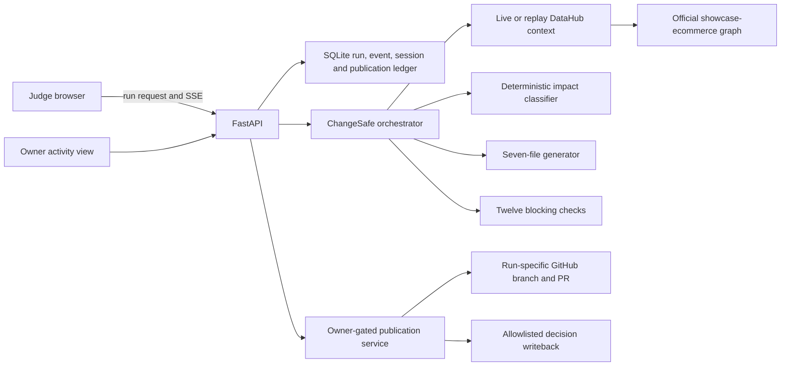

# ChangeSafe Judge Experience Redesign

**Date:** 2026-08-08

**Status:** Visual direction approved; implementation specification awaiting final review

**Selected concept:** [Judge command center](../../design/changesafe-judge-command-center-v1.png)

## 1. Decision summary

ChangeSafe will be presented as a live change-safety command center for data teams, not as a static form followed by a predetermined results page. The judge begins with a real schema-change proposal from DataHub's official `showcase-ecommerce` datapack and watches ChangeSafe read the contract, discover dependencies, classify impact, prepare a compatible migration, verify every generated artifact, and stop for accountable-owner approval.

The selected visual direction is the dark editorial control-room concept with:

- a change summary and evidence-led impact classification on the left;
- an interactive DataHub dependency graph in the center;
- a genuinely event-driven process transcript on the right; and
- five plain-language safety stages across the bottom.

The product headline is:

> Change data safely, with every dependency in view.

The supporting message is:

> ChangeSafe uses DataHub context to find affected systems and teams, generate a compatible migration, verify every artifact, and publish only after owner approval.

The phrase previously used to describe downstream scope is not part of the product messaging. ChangeSafe communicates concrete dependencies and evidence instead.

## 2. Product promise in plain language

A field rename can quietly break reports, models, privacy controls, and business processes. ChangeSafe checks what relies on that field before anybody publishes the change.

For the judge scenario, an analytics engineer proposes renaming `cust_email` to `primary_email` in the `order_details` dbt model. ChangeSafe reads DataHub metadata, maps the systems and teams that depend on the field, explains the kinds of harm a careless change could cause, creates a backwards-compatible migration, and proves that all seven generated files pass twelve blocking safety checks. It then pauses for an accountable owner. Only an approved change can be published to the configured GitHub sandbox and written back to the allowlisted DataHub demo graph.

ChangeSafe does not edit customer rows, execute warehouse SQL, merge a pull request, or deploy code automatically.

## 3. Audience and judge story

### Primary audience

- data platform and analytics engineers proposing schema changes;
- data owners accountable for governed data products;
- governance and privacy reviewers who need traceable evidence; and
- hackathon judges who should understand the workflow without data-engineering knowledge.

### Three-minute judge journey

1. The landing state identifies the official DataHub ecommerce scenario and explains the proposed rename in one sentence.
2. The judge starts an analysis without entering personal credentials.
3. The interface advances only when persisted run events arrive from the server.
4. The graph progressively reveals affected models, reports, systems, and owners with clickable DataHub evidence.
5. Six impact categories appear with severity, evidence, and confidence rather than a single unexplained score.
6. ChangeSafe prepares seven artifacts and reports each of twelve blocking checks as it completes.
7. The run stops at owner authorization and explains exactly what approval will publish.
8. In preview mode the judge receives a downloadable patch clearly labeled as not written. In owner-enabled sandbox mode, the owner can publish a run-specific GitHub branch and an allowlisted DataHub decision record.
9. The final receipt links to the pull request and DataHub evidence when those destinations exist.

## 4. Official demonstration data

### Canonical scenario

- DataHub datapack: `showcase-ecommerce`
- Data product: `Order Entry Analytics`
- Target platform: dbt backed by Snowflake
- Target asset URN: `urn:li:dataset:(urn:li:dataPlatform:dbt,b2fd91.ORDER_ENTRY_DB.analytics.order_details,PROD)`
- Target model: `order_details`
- Governed field: `cust_email`
- Proposed change: rename `cust_email` to `primary_email`
- Field classification: PII and governed

The official datapack supplies the recognizable multi-platform graph: Snowflake, dbt, Looker, Power BI, Tableau, governance metadata, domains, glossary terms, and owners. ChangeSafe may add a small, namespaced demo overlay only when the official graph lacks metadata required to make this exact field-level change reproducible. The overlay must not replace or falsely claim ownership of the organizer-provided data.

### Live, replay, and auto modes

- **Live:** read the allowlisted target from a real DataHub deployment and record sanitized tool evidence.
- **Replay:** load the checksum-pinned snapshot derived from the same official scenario and perform no network or mutation calls.
- **Auto:** attempt live context, pause truthfully on an eligible read failure, and continue with the labeled snapshot only after the user explicitly accepts the fallback.

The replay fixture remains necessary for judges, CI, and offline demonstrations. It must describe the same asset, field, owners, classifications, and downstream story as the live demo. The live adapter must accept the real graph shape rather than requiring an artificial exact number of downstream assets.

## 5. Information architecture

### Desktop command center

```text
+--------------------------------------------------------------------------------+
| ChangeSafe | headline + scenario badge                     | live provenance    |
+------------------+------------------------------------------+--------------------+
| Change summary   | dependency graph                         | live process       |
| and impact       | progressive nodes + evidence links       | event transcript   |
| classification  | selected-node evidence drawer            | active/pending      |
+------------------+------------------------------------------+--------------------+
| Observe          | Understand | Prepare | Prove | Authorize | after approval      |
+--------------------------------------------------------------------------------+
```

The desktop layout prioritizes the graph. The left and right rails remain readable at common laptop widths and collapse into ordered sections below 1024 px.

### Mobile order

1. headline and provenance;
2. change summary;
3. current process step;
4. compact five-stage rail;
5. impact classification;
6. horizontally pannable dependency map or accessible dependency list;
7. artifacts, validation evidence, and approval;
8. final receipt.

The mobile experience must not depend on hover. Every graph relationship is also available in an accessible list.

## 6. Visual and brand direction

### Character

ChangeSafe should feel like a calm, high-stakes data operations room: strong and precise, but not militaristic or sensational. The interface earns confidence by showing evidence and constraints.

### Brand system

- near-black navy canvas and deep-blue panels;
- warm cream display type for the editorial headline;
- high-legibility sans-serif type for operational text;
- teal and cyan for verified context, discovered relationships, and completed work;
- electric lime reserved for the active owner-authorization gate;
- amber and red reserved for high and critical evidence-led impact;
- a hexagonal shield mark containing connected lineage nodes;
- restrained grid, glow, and animated path energy that never reduce text contrast.

The implementation will use the project's existing icon library or another established icon set for interface symbols. It will not substitute hand-drawn SVG approximations for familiar actions.

### Canonical copy

Graph heading:

> Tracing what depends on `cust_email`

Graph explanation:

> We're finding the models, reports and teams that rely on this field before preparing the change.

Process messages:

1. Reading the existing data contract
2. Finding everything that depends on `cust_email`
3. Classifying business and technical impact
4. Preparing a compatible migration
5. Proving the generated change is safe
6. Waiting for the accountable owner
7. Publishing the approved change and evidence

These strings are the canonical source for implementation. Small text in the generated concept image is illustrative where image-generation typography differs.

## 7. Dynamic run experience

The animation must reflect real application state. It must never advance on a timer merely to look active.

| Product stage | Backend state or evidence | Interface behavior |
|---|---|---|
| Observe | `created`, `loading_context` | Pulse the DataHub source, show the target contract, then reveal nodes only as context evidence arrives. |
| Fallback | `context_fallback_required` | Freeze progress, label the live read attempt as unsuccessful, explain the snapshot choice, and require explicit continuation. |
| Understand | `scoring_risk` | Illuminate affected paths and populate impact categories from normalized context and deterministic rules. |
| Prepare | `generating` | Add artifact cards as server evidence identifies the generated bundle; never claim a file before it exists. |
| Prove | `validating` | Stream validation checks into the evidence panel and increment the count from actual report data. |
| Authorize | `awaiting_approval` | Focus the approval gate and state the exact destination and consequences of approval. |
| Preview | `preparing_preview` | Show patch preparation and clearly state that nothing external is being written. |
| Publish | `publishing` | Show checkpointed GitHub and DataHub steps from durable publication state. |
| Partial failure | `publication_failed` | Preserve successful receipts, identify the failed step, and offer retry only when the server says it is retryable. |
| Complete | `completed` | Present an evidence receipt with provenance, branch or patch, validation, and DataHub writeback status. |

The browser consumes persisted Server-Sent Events, deduplicates by sequence, stores the full active run ID, rebuilds history after refresh, and offers an explicit resume action for durable transitional states. A failed or interrupted phase is not marked complete merely because it was attempted.

Motion behavior:

- use 160–260 ms state transitions and slow path pulses for active lineage discovery;
- keep completed nodes stable rather than continuously animating;
- announce state changes through an `aria-live` region;
- preserve keyboard focus when panels update;
- disable nonessential movement under `prefers-reduced-motion` while retaining all status meaning.

## 8. Impact classification

A single risk score remains available as a technical summary, but the primary explanation is a set of human-readable impact categories.

| Category | Demo severity | Meaning | Evidence examples |
|---|---|---|---|
| Data integrity | Critical | A careless rename can break contracts or create inconsistent fields. | target schema, downstream field lineage, generated compatibility view |
| Privacy and compliance | Critical | The field carries governed PII and must retain its controls. | tags, glossary terms, structured properties, owners |
| Operational continuity | High | Jobs, models, dashboards, or services may fail or become stale. | downstream production assets and lineage paths |
| Trust and decision quality | High | Reports can silently become incomplete or misleading. | executive and reporting dependencies |
| Financial exposure | Potentially high, not quantified | Revenue or operational workflows may rely on the field, but metadata alone does not prove a dollar amount. | revenue-oriented downstream assets, labeled as inferred |
| Organizational impact | High | Multiple owners and teams may need coordinated migration timing. | domains, ownership, cross-system consumers |

Each category must expose:

- `severity`: critical, high, medium, low, or informational;
- `summary`: one plain-language consequence;
- `confidence`: direct, inferred, or unavailable;
- `evidence`: one or more URNs or normalized evidence references;
- `basis`: the deterministic rule that produced it.

Direct metadata and inferred business implications must be visually distinguishable. The application must not invent revenue loss, compliance penalties, customer counts, or certainty not supported by the context.

## 9. Interaction details

### Change summary

The official scenario is selected by default. Advanced users can still enter an allowlisted URN and supported rename, removal, or type-change operation. The summary explains the current field, proposed field, asset, platform, data product, governance labels, request source commit, and evidence provenance.

### Dependency graph

- center the target `order_details` model;
- group upstream and downstream nodes by direction and system;
- progressively reveal nodes from real normalized context;
- use line styling and arrows to express direction without relying on color alone;
- allow zoom, pan, reset, and keyboard traversal;
- open a side drawer with name, type, domain, owner, relationship, path, evidence source, and a safe DataHub deep link;
- show a compact list alternative for accessibility and small screens;
- do not imply a direct path when DataHub returned only a degree or endpoint.

### Evidence and artifacts

The results area retains the existing artifact explorer and twelve-check validation report, restyled to fit the command center. Generated SQL, YAML, tests, migration notes, and the manifest are rendered as text, never injected HTML. The user can inspect or download the seven-file bundle or preview patch.

### Approval

The approval card states:

- whether the run is preview-only or owner-enabled live publication;
- the GitHub repository and base branch when configured;
- the DataHub destination and allowlisted target;
- which steps have already completed on a retry;
- whether a failure is retryable; and
- that ChangeSafe does not merge the pull request or execute warehouse SQL.

Authorization errors appear next to the owner-token control and keep focus in that panel. General failures appear beside the affected process step with a plain-language recovery action.

## 10. Shared judge sandbox

Judges must not provide DataHub, GitHub, or OpenAI secrets. All service credentials remain server-side.

Each browser receives an anonymous session identifier. The shared environment records only operational demo facts needed to observe and support the judging session:

- anonymous session ID;
- run ID and start time;
- selected scenario;
- current and final phase;
- preview, publication, and retry outcome;
- resulting pull-request and writeback identifiers when present.

It does not record hidden personal details or copy PII values from the demo graph. The owner activity view shows active sessions and recent runs without exposing service credentials.

Sandbox controls:

- a narrow allowlist of demo URNs and publication destinations;
- a run-specific GitHub branch and artifact-bound idempotency key;
- owner-gated external mutation;
- per-session and edge rate limits;
- request-size, schema, generated-path, and SQL-type validation;
- persisted publication checkpoints and fail-closed destination binding;
- automatic cleanup policy for sandbox branches and decision documents where the destination supports safe cleanup;
- replay fallback if the shared live environment is unavailable, labeled clearly before continuation.

## 11. Architecture changes



Required application changes:

1. Extend the public analysis contract with evidence-led impact categories while preserving the deterministic numeric risk result for compatibility.
2. Map persisted run states and events to the seven plain-language process messages.
3. Add an official `order_details.cust_email` scenario preset and align the checksum-pinned replay fixture to it.
4. Generalize live lineage rendering and assertions to the actual DataHub graph instead of an exact synthetic node count.
5. Add safe DataHub deep-link construction for evidence URNs.
6. Add anonymous judge-session persistence and an owner activity API/view with privacy-limited fields.
7. Restyle the existing React components around the selected command-center shell, retaining current artifact, validation, approval, recovery, and receipt capabilities.
8. Preserve current server-side secrets, allowlists, durable idempotency, policy re-verification, destination binding, and preview safety.

The first public deployment remains single-instance because the project uses SQLite and in-process analysis. A horizontally scaled deployment requires a shared transactional store, durable task queue, and distributed rate limiter.

## 12. Security and truthfulness rules

- Service secrets never enter browser JavaScript, public configuration responses, screenshots, logs, or generated artifacts.
- Judges never paste DataHub or GitHub credentials into the interface.
- DataHub and GitHub publication remain disabled unless explicit server-side flags, credentials, owner authorization, destination bindings, and passing verification are all present.
- Replay is always labeled snapshot; live is always labeled live; fallback never changes provenance silently.
- A successful visualization cannot outrun persisted backend evidence.
- Unsupported schema shapes, unknown field types, unsafe SQL types, destination drift, artifact drift, and malformed mutation acknowledgements fail closed.
- Financial impact is described qualitatively unless a source supplies an attributable amount.
- DataHub links are treated as external links, validated against the configured origin, and opened with safe rel attributes.
- The shared deployment uses HTTPS, secure headers, edge rate limiting, and restricted CORS/same-origin behavior.

## 13. Accessibility and responsive quality

- WCAG AA contrast for text and non-text status indicators;
- visible keyboard focus on every control and graph node;
- semantic headings and ordered process steps;
- no state communicated by color alone;
- an accessible text equivalent for the dependency graph;
- live status announcements that do not overwhelm screen readers;
- 44 px minimum primary touch targets;
- no horizontal page overflow at supported mobile widths;
- reduced-motion support;
- persistent error context and recovery controls after refresh.

## 14. Testing strategy

Implementation follows test-first changes for each behavior.

### Backend

- unit tests for all six impact categories, evidence, direct versus inferred confidence, and no fabricated financial amount;
- context contract tests for the official target, field-level lineage, owners, tags, terms, structured properties, null fields, nested paths, quoted top-level fields, and unknown native types;
- replay checksum and live/replay semantic-parity tests;
- API tests for session creation, privacy-limited activity records, allowlists, rate limits, fallback, and DataHub link construction;
- publication tests for owner gating, retries, crash recovery, destination binding, branch-tree integrity, exact mutation acknowledgement, and no cross-run reuse of incomplete decisions;
- current-policy, risk, artifact, and validation re-checks at approval.

### Frontend

- component tests for every state-to-message mapping;
- progressive graph revelation driven by events rather than timers;
- impact category evidence and confidence rendering;
- live, replay, fallback, preview, publishing, partial-failure, and completion provenance labels;
- refresh recovery with event-history reconstruction and explicit transitional-state resume;
- owner-token focus and non-retryable error behavior;
- header truthfulness under configuration drift;
- keyboard graph/list equivalence and reduced-motion behavior;
- responsive desktop and mobile layouts.

### End to end and visual QA

- credential-free official-scenario replay flow;
- shared-sandbox live flow when deployment credentials are supplied;
- explicit live-to-snapshot fallback;
- owner approval and preview distinction;
- persisted refresh during analysis and publication;
- twelve passing checks and seven generated files;
- real clickable evidence, PR, and DataHub receipt links where configured;
- Playwright desktop and mobile screenshots regenerated from the current build;
- browser-console, overflow, broken-link, keyboard, and accessibility checks.

All existing Ruff, strict mypy, Python, secret scan, frontend lint, TypeScript, Vitest, production build, Playwright, dbt, example-regeneration, and diff-integrity gates remain mandatory.

## 15. Deployment and access requirements

Local implementation and replay testing require no new access. A truthful shared live judge deployment needs:

- a public Linux host or suitable managed host for the single ChangeSafe container;
- a reachable DataHub Cloud sandbox or Linux-hosted DataHub demo loaded with `showcase-ecommerce` and the minimal overlay;
- server-side DataHub credentials with the least privileges needed for allowed reads and decision writeback;
- a sandbox GitHub repository and token limited to branch, commit, and pull-request operations;
- HTTPS and edge rate limiting;
- optional OpenAI credentials for bounded narrative assistance, with deterministic generation retained as the safe fallback.

The service starts in preview/replay mode when these credentials are absent. Configuration documentation must identify where each value comes from, which values are optional, and how to validate them without displaying secrets.

## 16. Figma deliverable

After the web implementation passes functional tests, create a Figma file that mirrors the implemented desktop and mobile states rather than an aspirational design disconnected from the product. It will contain:

- brand tokens and typography;
- reusable change-summary, impact, graph-node, process-step, evidence, validation, approval, and receipt components;
- desktop states for loading, impact classification, authorization, failure, and completion;
- a mobile completion and active-run state; and
- annotations mapping visible states to backend events.

## 17. Rollout sequence

1. Add failing domain and API tests for impact classification and official scenario context.
2. Implement the impact contract and official datapack-aligned replay/live context.
3. Add failing frontend tests for the new state mapping and progressive command-center shell.
4. Build the desktop experience using the current component capabilities.
5. Add responsive and accessible graph/list behavior.
6. Add the privacy-limited judge session and owner activity experience.
7. Verify preview, fallback, live publication, crash recovery, and receipts.
8. Run the complete repository gates and regenerate screenshots.
9. Create the implementation-matched Figma file.
10. Update README, demo script, Devpost copy, environment guidance, and deployment runbook.

## 18. Acceptance criteria

The redesign is complete only when:

- the official `showcase-ecommerce` Order Entry Analytics scenario is the visible golden demonstration;
- the headline, graph explanation, and seven process messages match this specification;
- no deprecated downstream-scope phrase appears in judge-facing product copy;
- progress is derived from persisted server events, not staged timers;
- a refresh reconstructs truthful history and can resume eligible durable states;
- the graph and accessible list show evidence-backed dependencies with working DataHub links;
- all six impact categories show severity, confidence, and evidence without invented amounts;
- the UI distinguishes live, replay, fallback, preview, and published outcomes at all times;
- seven generated files and twelve blocking checks are shown from actual analysis data;
- judges need no personal service credentials;
- external writes require owner authorization and stay within configured sandbox destinations;
- preview mode never claims an external write;
- desktop and mobile experiences meet the accessibility requirements;
- the owner can observe privacy-limited anonymous session activity;
- automated tests and full repository quality gates pass; and
- current screenshots, README, demo script, submission copy, environment guidance, and Figma deliverable agree with the implemented product.

## 19. Non-goals

- editing warehouse data or running migration SQL;
- automatically merging GitHub pull requests;
- supporting arbitrary public DataHub URNs or GitHub destinations in the shared sandbox;
- presenting inferred business harm as measured fact;
- replacing DataHub's catalog UI;
- building a multi-tenant enterprise control plane in this hackathon scope;
- horizontal scaling before the shared-store and durable-queue architecture exists.
